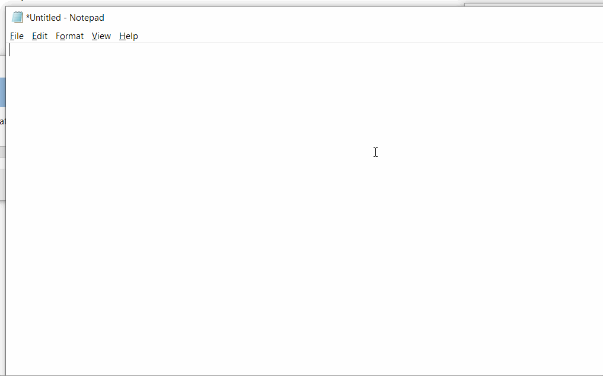
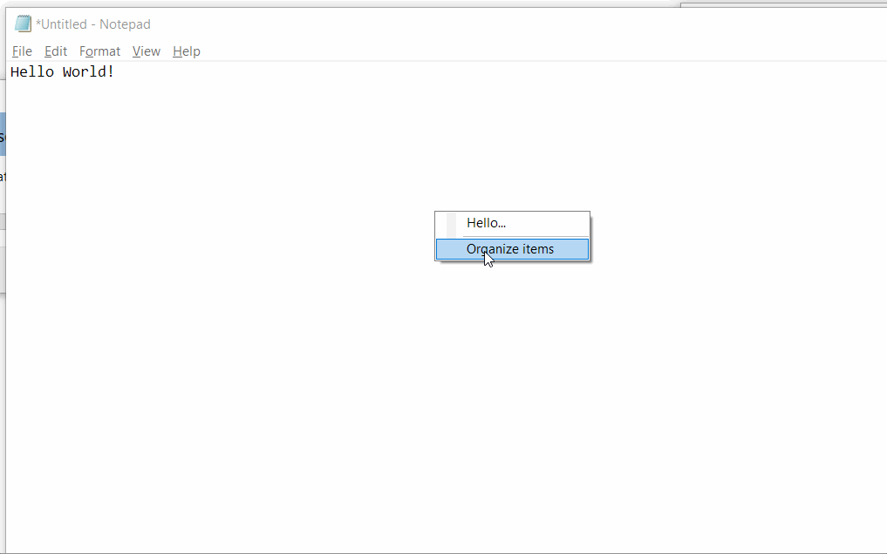

# GC-Menu - Global Context Menu

GC-Menu is a very simple application that aims on improving your user experiences when working on Windows. 

Basically GC-Menu is a typing assistance tool that allows you to have you frequently typed text fragments (e.g. email, address) available for automatic typing in the input application of you choice.
You just need to have your application active. Invoke _GC-Menu_ menu. Select the desired text to type and _GC-Menu_ will trigger the typing for you:  




GC-Manu allows defining a custom menu that can be invoked at any time system wide. When a given menu item is selected a strokes of key strokes (defined in the menu item data) is sent to the window that was active at the time of the menu popping up.
The menu items are defined in a text file with an extremely simple syntax:

```
<display text>|<insertion text>
```



The GC-Manu application is a hidden application that runs in background and listens to the system keyboard input. When the dedicated hotkey (configurable key combination) is pressed by the user the selection 
menu is popped up.

You can configure hotkey via the settings panel.


You can display it by double-clicking the application tray icon.


     
 
